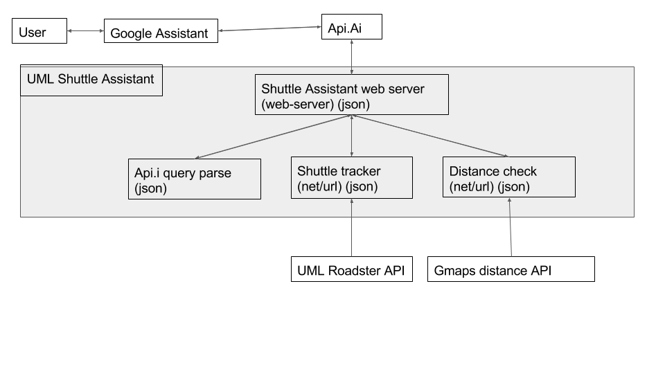

# UMLShuttle-Assistant

# Overview

Umass lowells shuttle tracking system is nice, but it's missing one thing to be truely useful to students, and that's ability to give an estimate of exactly how long it will take for the next shuttle to arrive at a certain stop. This project was created as a way to give students the ability to figure out exactly that through various platforms that api.ai intergrates with, which as of right now is just api.ai itself and facebook messenger. 

This program starts off by immediatly initiating an parsing object that holds and delivers a hash-table(routes_hash)containing the different lines and an updater in a seperate thread.
 ```
 (define routes_hash
  (let
      ([routes (make-hash)]
       [active_lst '()])
```
 It does this automatically by checking in the dispatch if routes is empty and then returning the dispatch function  ```[(hash-empty? routes) (create_lines)  dispatch]``` 

The ```(create_lines)``` function uses for-each over a list that's generated from ```(active_lines)``` and it updates the routes hash that's defined above in the let definition.
It does this by parsing each individual route endpoint for the active shuttles which is a hash of the shuttle name to the shuttle struct using a foldl and function called ```create-buses``` which inititalizes all of the bus structs with the name, id, type, and location. and then passes it to ```active_shuttles_on``` which is set to the correct line in the hash table.

```
    (define (create_lines) ;; creates a list of lines with all active shuttles and last stop
      (for-each
       (λ (x)
         (let [(shuttlelst (active_shuttles_on (route_url (car x)))) (stoplst (get_stops (car (cddr x))))]
           (hash-set! routes
                      (cadr x)
                      (line
                       (cadr x) ;; name
                       (car x) ;; id     
                       shuttlelst ;; shuttles
                       stoplst
                       ) )))
       (active_lines)))

 (define (active_shuttles_on line_in)
      (define shuttles (make-hash))
      (define json_read (json_in line_in))
      (for-each  (λ (x)
                   (hash-set! shuttles
                              (bus-id x) x))   
                 (foldl create-buses '() json_read))
      shuttles)

  (define (create-buses shuttle shuttle-list) 
      (cons (let [(location (hash-ref shuttle 'Location))
                  (numb (hash-ref shuttle 'Number))]
              (bus 
               numb
               (string-ref numb 0) ; type
               (list
                (hash-ref location 'Latitude)
                (hash-ref location 'Longitude)) ;gps 
               "nope")) ;;nope is for last stop
            shuttle-list ))

```


When creating the routes_hash it uses the route name from the list as the key and the id number gets used to then parses each individual line endpoint for the list of active shuttles 


while generating the 

### External Technologies
This project connects to

Actions on Google (Google Asstant)
API.AI 
api.uml.edu


## Architecture Diagram


## Schedule
